# Sign of Magic

Фентези VR-игра в жанре Rouge-like с несколькими локациями в разных стилях и "открытым" миром. Цель - одолеть главных боссов каждой локации. Взаимодействие через руны на руке, механика ходьбы - телепортация, магические способности для боя с мобами/боссами.

[Видео](https://drive.google.com/file/d/1eJfrREnC74UGLQ2q3yiUQ3fuvXoU4_-3/view?usp=share_link)

---

# Images

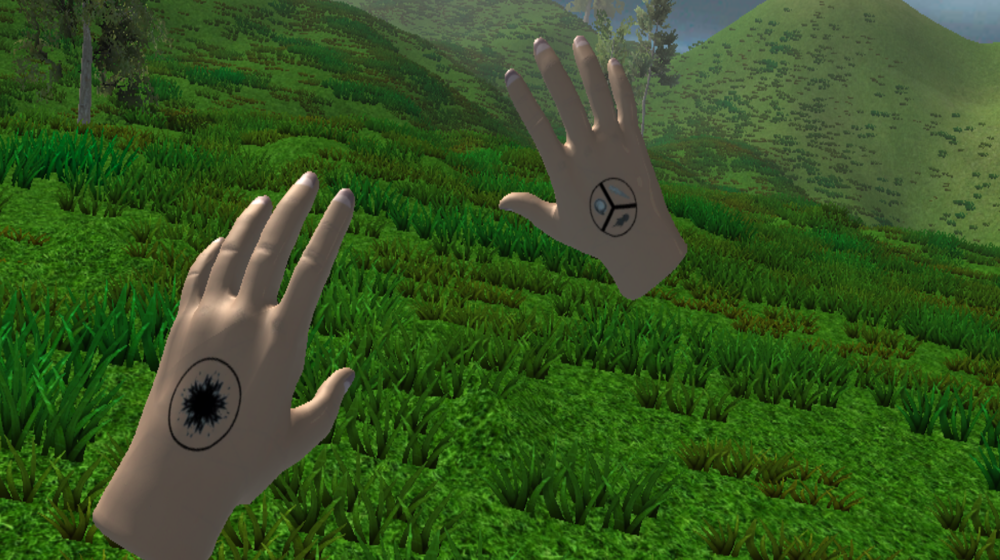

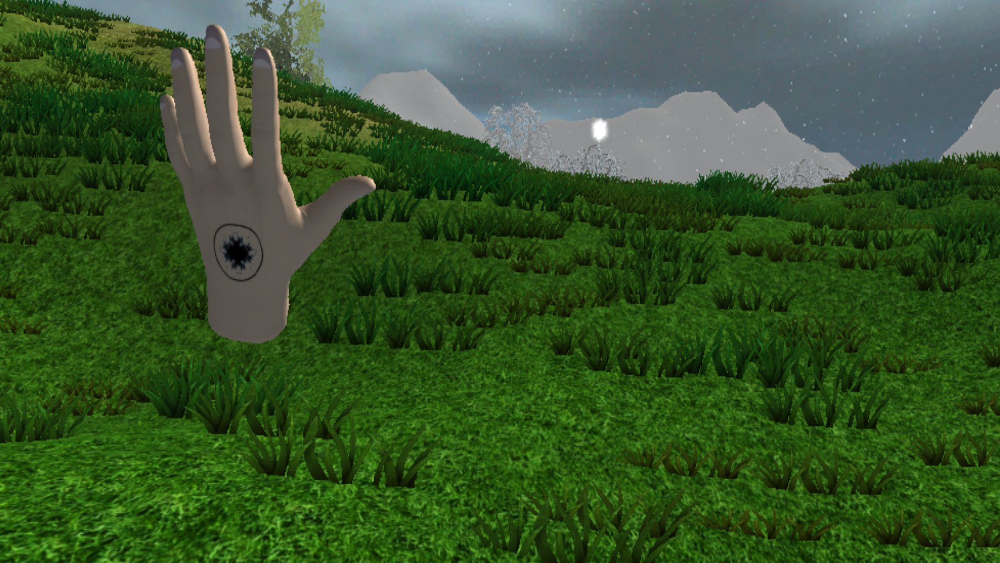
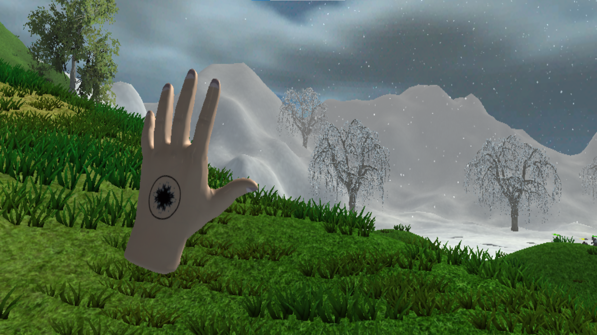
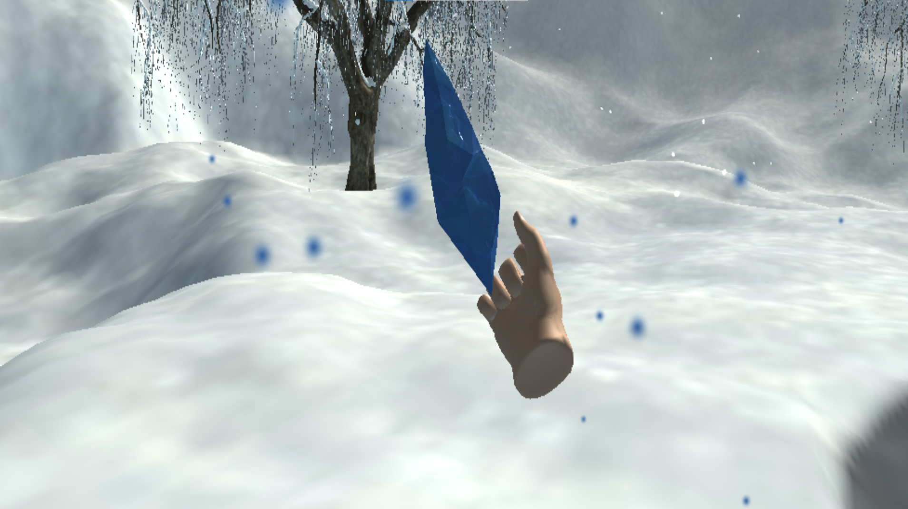
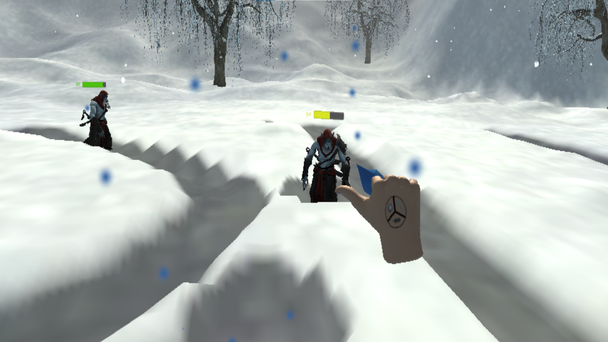
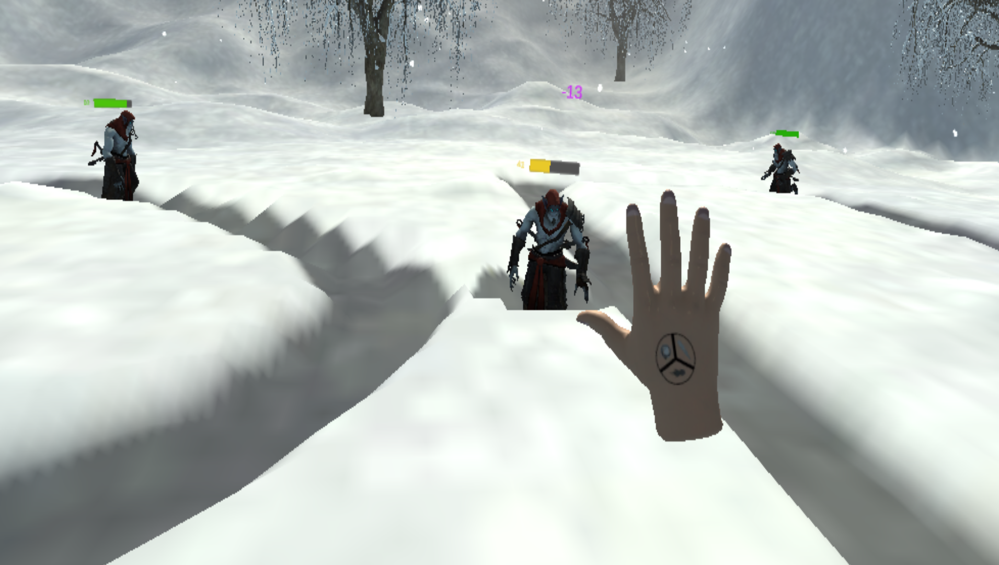
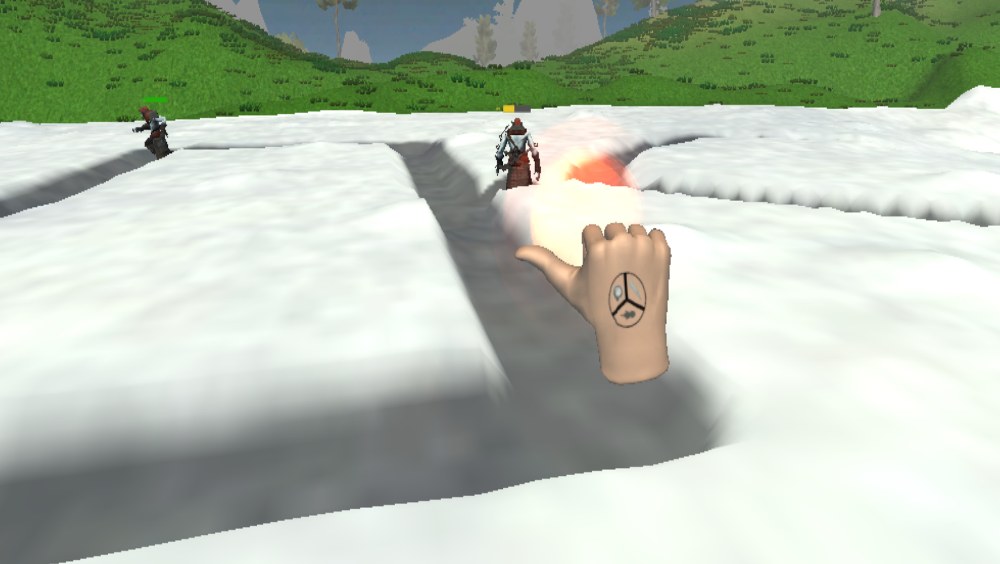
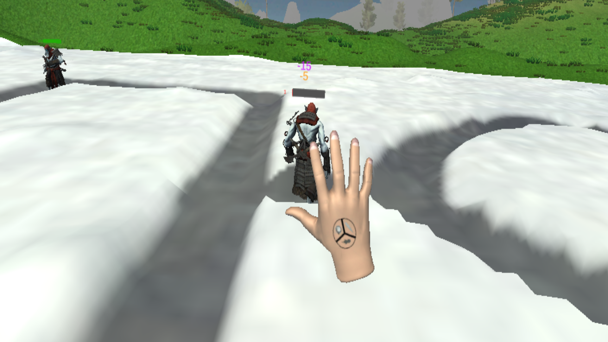
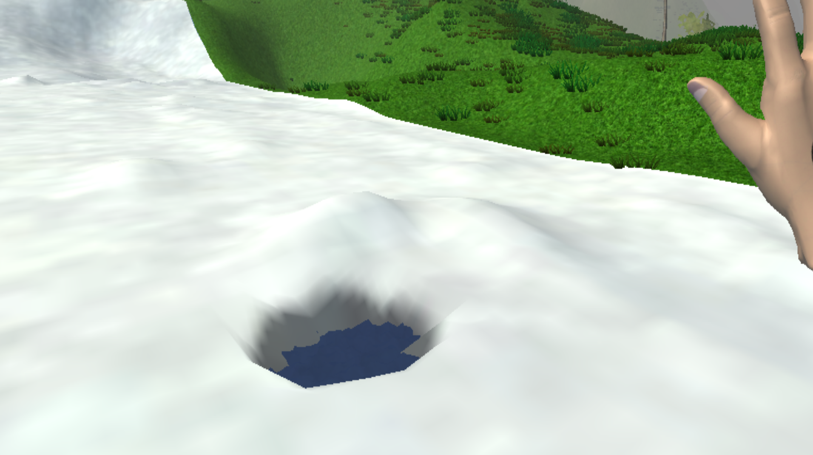

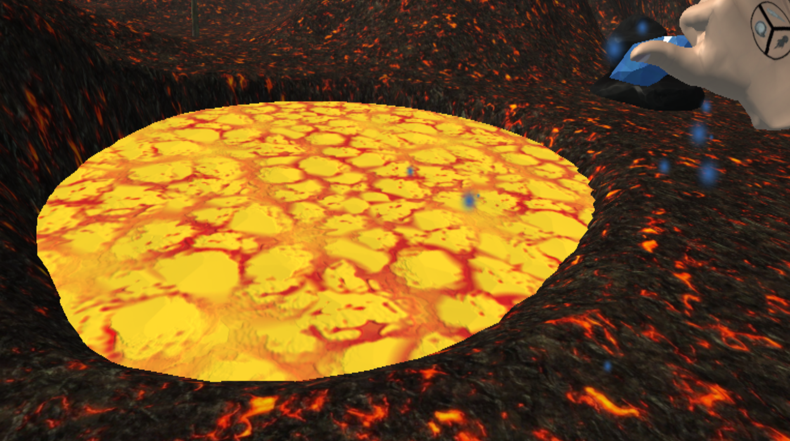

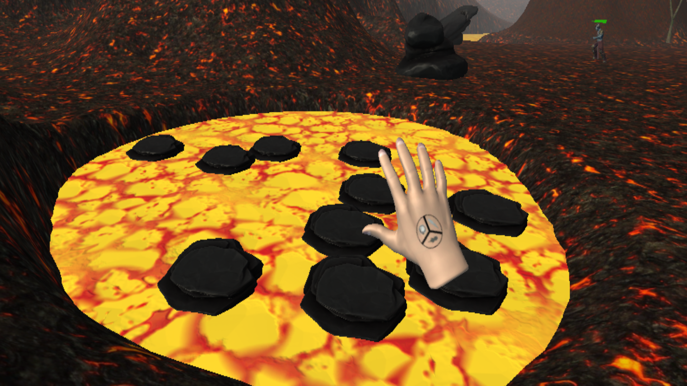
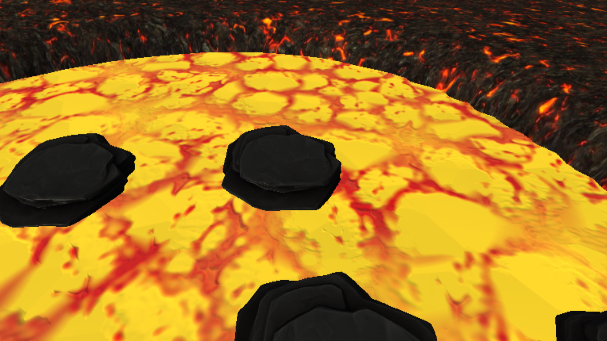

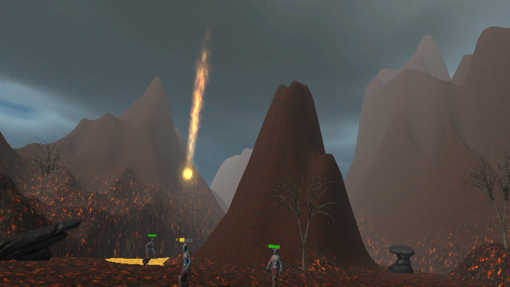
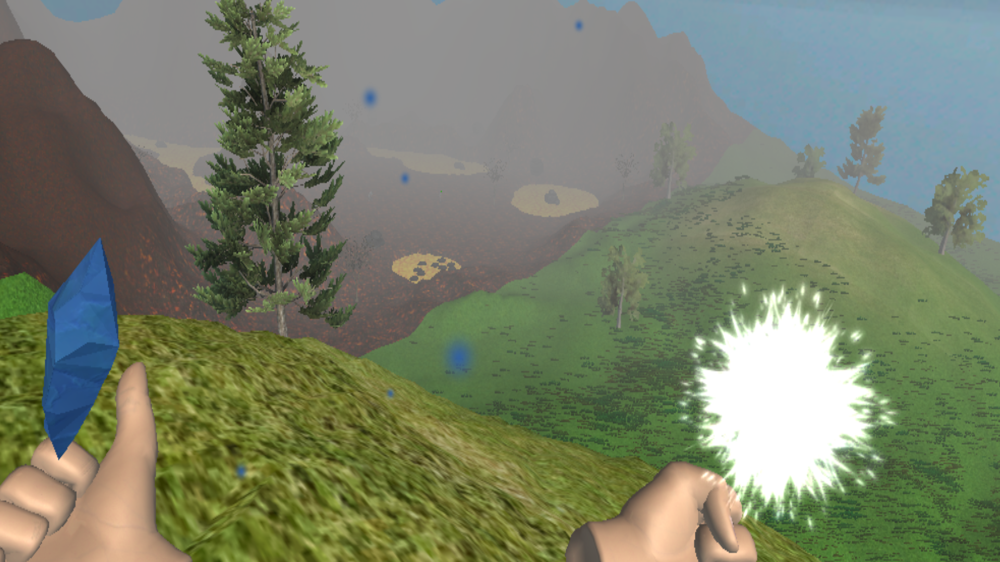
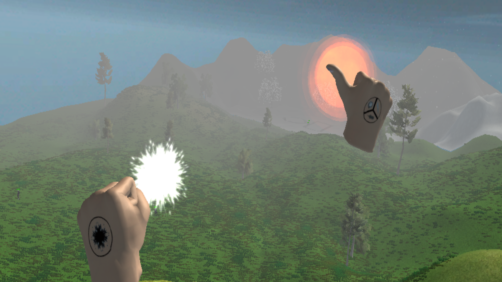

---

# Tech
* C#
* 3D modeling
* Unity 3D

---

# Developers
* Баканова М.В.
* Новаков Н.Ю.

---

